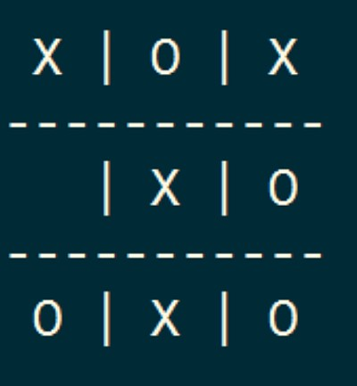

# TicTacToe Class Documentation

## About

A object-oriented programming (OOP) command-line program for a standard Tic-Tac-Toe game.

Options include two-player and single-player vs. computer.

Instantiate like this:

`tic_tac_toe = TicTacToe()`

and run:

`tic_tac_toe.run()`

---

### Documentation:

_Printed via `help(TicTacToe)`:_

```
Help on class TicTacToe in module __main__:

class TicTacToe(builtins.object)
 |  This is a class for a text-based Tic-Tac-Toe game playable in the command-line.
 |  
 |  :ivar amt_players: Determines one or two players. :type: int
 |  :ivar player_1: Player 1's symbol 'X'. :type: str
 |  :ivar player_2: Player 2's symbol 'O'. :type: str
 |  :ivar current_symbol: Active player's symbol. :type: str
 |  :ivar current_board: Current game board. :type: dict
 |  :ivar routes: List of strings for current rows, columns and diagonals. :type: list
 |  :ivar current_player: Active player. :type: int
 |  :ivar player_1_win: Player 1's total wins. :type: int
 |  :ivar player_2_win: Player 2's total wins. :type: int
 |  :ivar turn_count: Number of turns played, maxes out at 9. :type: int
 |  
 |  Methods defined here:
 |  
 |  __init__(self)
 |      The constructor for TicTacToe class.
 |  
 |  align_symbol(self)
 |      Switches user upon turn end.
 |  
 |  display_board(self)
 |      Displays the current game board in a readable format.
 |  
 |  game_status(self)
 |      Credits appropriate player with victory in running match score.
 |  
 |  play_game(self)
 |      Logic to play game. Alternates between users with appropriate symbols.
 |  
 |  reset(self)
 |      Resets the game board dictionary.
 |      
 |      :return brd_reset: Fresh version of the game board. :type: dict
 |  
 |  run(self)
 |      Introduces the game and prompts the user to play. Offers user option to exit program.
 |  
 |  switch_player(self)
 |      Logic to alternate players.
 |  
 |  user_choice(self, row_column_str: str)
 |      Function to create variable when asking user input for row or column.
 |  
 |  win_logic(self)
 |      Checks for game winner. Tabulates overall match score.
 |  
 |  ----------------------------------------------------------------------
 |  Static methods defined here:
 |  
 |  check_quit(user_input: str)
 |      Checks input for exit request.
 |  
 |  generate_choice()
 |  
 |  intro_banner()
 |      Defines the initial text the user sees.
 |  
 |  trim_space(vals: list) -> str
 |      Trim spaces from list of winning route values.
 |      
 |      :param vals: List of strings representing a row, column or diagonal. :type: list
 |      :return trimmed_route: The given row, column or diagonal without spaces. :type: str
```

---

## Angela Yu Udemy Assigment:

I made this class in completing 'Professional Portfolio Project - [Python Scripting], Assigment 3: Tic Tac Toe' from:

Angela Yu's [100 Days of Code: The Complete Python Pro Bootcamp](https://www.udemy.com/course/100-days-of-code/)

### Assignment: Tic Tac Toe

#### _Build a text-based version of the Tic Tac Toe game._

Using what you have learnt about Python programming:

- Build a text-based version of the Tic Tac Toe game.
- The game should be playable in the command-line just like the Blackjack game we created on Day 11.
- It should be a 2-player game, where one person is "X" and the other plays "O".

This is a simple demonstration of how the game works:

https://www.google.com/search?q=tic+tac+toe

You can choose how you want your game to look. The simplest is to create a game board using "|" and "_" symbols. But the
design is up to you.



If you have more time, you can challenge yourself to build an AI player to play the game with you.

#### Questions for this assignment

_Reflection Time:_

This is a place to journal your experience of completing this project. This will help you figure out how to improve as a
developer.

Write down how you approached the project. What was hard, what was easy. How might you improve for the next project?
What was your biggest learning from today? What would you do differently if you were to tackle this project again?
